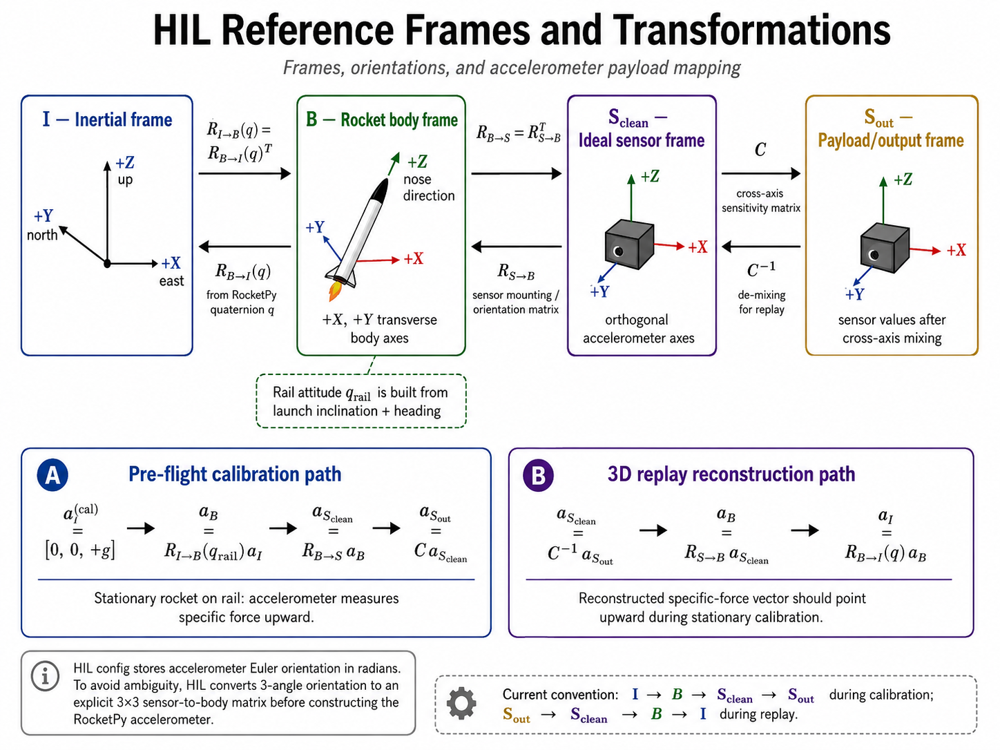

# RocketPy HIL Simulation

This document is the single technical reference for the current RocketPy hardware-in-the-loop simulation used to drive the ESP32 flight-controller HIL TCP interface.

## Current scope

The current HIL system provides:

- a RocketPy-based simulator launcher;
- JSON/JSONC rocket configuration with formula support;
- explicit sensor profiles selected from the CLI;
- pre-flight stationary calibration before RocketPy `Flight(...)` starts;
- a lockstep TCP protocol between simulator and flight controller;
- JSON capture files with replay, plots, and run summaries;
- a local mock Manny/FC TCP server for development without hardware;
- shared reference-frame helpers for calibration and 3D replay.

Main files:

| File | Current role |
|---|---|
| `hil_rocketpy.py` | Builds RocketPy objects, starts TCP communication, sends calibration samples, runs `Flight(...)`, records capture data, and plots the run. |
| `hil_config.py` | Loads JSON/JSONC config, resolves formulas, filters metadata keys, normalizes paths/tuples/pair-lists, applies ordered `_calls`, and resolves sensor profiles. |
| `hil_communication.py` | Implements TCP framing, packet encode/decode, lockstep mailbox, reset handling, and FC command handling. |
| `hil_capture.py` | Saves/loads captures, prints summaries, plots telemetry, and replays 3D attitude/reference-frame data. |
| `hil_utils.py` | Shared rotation, rail-attitude, accelerometer mounting, and cross-axis helpers. |
| `mock_manny_fc_server.py` | Local deterministic FC emulator for protocol and FSM tests. |
| `config/<rocket>/<rocket>_rocketpy_config.jsonc` | Rocket-specific RocketPy/HIL configuration. |

## Installation

### 1. Clone RocketPy
```bash
git clone --depth=1 https://github.com/RocketPy-Team/RocketPy.git
cd RocketPy
```

### 2. Python Environment
```bash
python3 -m venv venv_dev_rocketpy
source venv_dev_rocketpy/bin/activate
```

> [!NOTE] This version is still using the modified version of the RocketPy simulator with the RocketV2 class that exposes "add_state_and_sensors_logger()" method. Consider changing it to the wrapper in order to not depend on the internal code structure of RocketPy.
### 3. Modify RocketPy
1. add ```rocket_v2.py``` in ```RocketPy/rocketpy/rocket/```,
2. modify the ```__init__.py``` in ```RocketPy/rocketpy``` and expose ```RocketV2``` class:
```python
from .rocket import (
    AeroSurface,
    AirBrakes,
    Components,
    EllipticalFins,
    Fins,
    FreeFormFins,
    GenericSurface,
    LinearGenericSurface,
    NoseCone,
    Parachute,
    PointMassRocket,
    RailButtons,
    RocketV2, # modify this line
    Tail,
    TrapezoidalFins)
```
3. modify the ```__init__.py``` in ```RocketPy/rocketpy/rocket``` and expose ```RocketV2``` class:
```python
from rocketpy.rocket.rocket_v2 import RocketV2   # modify this line
```

Bugs:
1. [THIS HAS BEEN FIXED] ~~~change ```RocketPy/rocketpy/simulation/flight.py#L3746```, comment ```tmp_dict[time]._controllers += node._controllers``` (duplicated, adding twice the controllers).~~~
2. Controllers callback are called twice: 
   - [self.__process_sensors_and_controllers_at_current_node(node, phase)](https://github.com/RocketPy-Team/RocketPy/blob/cb15a393ee2d9430cc21c57c98768dc1890a198a/rocketpy/simulation/flight.py#L699-L700)
   - COMMENT THIS ONE OUT in `flight.py#L701`: [for controller in node._controllers:](https://github.com/RocketPy-Team/RocketPy/blob/cb15a393ee2d9430cc21c57c98768dc1890a198a/rocketpy/simulation/flight.py#L701)
3. `accelerometer.py` measure method gives weird values. Instead of -1g+1g=0g, it was giving -1g-1g=-2g and also there was a mix in the reference frames.
   - Modify the Accelerometer class in `rocketpy/sensors/accelerometer.py`. Patch the `measure()` method with the code present in the `accelerometer_patch.py`.
   - Modify the Sensor class in `rocketpy/sensors/sensor.py`. Make the `cross_axis_matrix` an attribute in order to make it visible outside the `init()` method:
      ```python
      self.cross_axis_matrix =  [...] # add self.

      self._total_rotation_sensor_to_body = (
          self.rotation_sensor_to_body @ self.cross_axis_matrix # add self.
      )
      ```

### 4. Install RocketPy from source
```bash
pip install -r requirements.txt
pip install .
```

### 5. Run the simulation
- build ```main_hil.cpp``` and flash ```atlas-esp-idf```.
- connect to the board WiFi SoftAP, for example `Aurora AP` at `192.168.4.1`.
- ```bash
  cd main/hil
  python3 hil_rocketpy.py --rocket=fred --sensor-profile=clean
  python3 hil_rocketpy.py --rocket=nemesis --sensor-profile=clean
  ```

The launcher requires an explicit rocket and sensor profile:

```bash
python hil_rocketpy.py --rocket fred --sensor-profile clean
python hil_rocketpy.py --rocket fred --sensor-profile noisy
python hil_rocketpy.py --rocket fred --sensor-profile very_noisy
```

Useful options:

```bash
python hil_rocketpy.py --rocket fred --sensor-profile clean --sampling-rate 50
python hil_rocketpy.py --rocket fred --sensor-profile clean --no-startup-reset
python hil_rocketpy.py --rocket fred --sensor-profile clean --startup-reset-timeout 30
```

The FC endpoint is configured with environment variables:

```bash
HIL_FC_HOST=192.168.4.1 HIL_FC_PORT=5000 python hil_rocketpy.py --rocket fred --sensor-profile clean
```

Local mock run:

```bash
python mock_manny_fc_server.py
HIL_FC_HOST=127.0.0.1 python hil_rocketpy.py --rocket fred --sensor-profile clean
```

## Configuration model

The config is intentionally close to RocketPy naming. Sections such as `Environment`, `SolidMotor`, `RocketV2`, `add_motor`, and `Flight` map to RocketPy constructors or methods.

Rules:

- non-underscore keys are forwarded to RocketPy after mechanical JSON-to-Python conversion;
- keys starting with `_` are local HIL/config metadata and are not forwarded;
- relative paths are resolved from the selected rocket config folder;
- tuple-like fields are converted from JSON lists to tuples;
- atmospheric pair-list fields such as `pressure`, `temperature`, `wind_u`, and `wind_v` are converted from lists to tuple pairs;
- mandatory sections fail immediately if missing;
- optional rocket components are applied only when their section exists.

Mandatory sections:

```text
Environment
SolidMotor
RocketV2
add_motor
Flight
Sensors
```

### Ordered RocketPy calls

Object setup that cannot be represented as constructor kwargs uses `_calls`. The main case is `Environment`, where `set_date` must run before atmospheric model loading.

```jsonc
"Environment": {
  "latitude": 44.290583,
  "longitude": 12.027111,
  "elevation": 18,
  "max_expected_height": 4500,
  "_calls": [
    {
      "method": "set_date",
      "kwargs": {
        "date": [2025, 5, 9, 12]
      }
    },
    {
      "method": "set_atmospheric_model",
      "kwargs": {
        "type": "Ensemble",
        "file": "Villafranca_ensemble_5to11may2020to2026.nc"
      }
    }
  ]
}
```

The launcher:

1. passes non-underscore keys to `Environment(**kwargs)`;
2. applies `Environment._calls` in list order;
3. rejects direct `set_date`, direct `set_atmospheric_model`, dotted aliases, and top-level environment calls.

### Formulas

Formulas are strings starting with `=` and must evaluate to numbers.

Examples:

```jsonc
"mass": "= $RocketV2._dry_mass + $RocketV2._ballast"
"position": "= $add_tail.position + $add_tail.length"
"cd_s": "= $_cd * $_area"
"_wind_u_ground": "= $_wind_magnitude_ground_m_s * sin(radians($_wind_heading_deg))"
```

Reference rules:

- `$Section.key` reads from the root config;
- `$_local_key` reads from the current object first;
- only whitelisted numeric functions are available;
- cyclic references fail during config loading.

## Sensor profiles

Sensor profiles live under `Sensors._profiles`. The CLI profile name must match the profile key exactly.

Current supported sensor types:

```text
Accelerometer
Barometer
GnssReceiver
```

Rules:

- `clean` is required;
- `clean` starts from zero-noise defaults and may override fields;
- non-clean profiles inherit `clean` by default;
- `_inherits` may point to another profile;
- `"_inherits": null` disables inheritance;
- unknown sensor types fail fast;
- `sampling_rate` is not allowed inside a profile because the launcher injects the CLI sampling rate into all sensors;
- per-sensor `_position` overrides `Sensors._default_position`.

Typical structure:

```jsonc
"Sensors": {
  "_default_position": 0,
  "_profiles": {
    "clean": {
      "Accelerometer": {
        "name": "Clean Accelerometer",
        "consider_gravity": true,
        "orientation": [0, 0, 0]
      },
      "Barometer": { "name": "Clean Barometer" },
      "GnssReceiver": { "name": "Clean GPS" }
    },
    "noisy": {
      "_inherits": "clean",
      "Accelerometer": {
        "name": "Noisy Accelerometer",
        "measurement_range": 160.0,
        "resolution": 0.005,
        "noise_density": 0.18,
        "noise_variance": 1.0,
        "random_walk_density": 0.02,
        "random_walk_variance": 1.0,
        "constant_bias": 0.35,
        "operating_temperature": 298.15,
        "temperature_bias": 0.002,
        "temperature_scale_factor": 0.003,
        "cross_axis_sensitivity": 0.3
      }
    },
    "very_noisy": {
      "_inherits": "noisy",
      "Accelerometer": {
        "name": "Very Noisy Accelerometer",
        "noise_density": 0.35,
        "random_walk_density": 0.05,
        "constant_bias": 0.75,
        "temperature_bias": 0.006,
        "cross_axis_sensitivity": 1.0
      }
    }
  }
}
```

## Reference frames



Frame convention:

| Symbol | Meaning | Axes |
|---|---|---|
| `I` | RocketPy inertial frame | `+X` east, `+Y` north, `+Z` up |
| `B` | RocketPy body frame | `+Z` points toward the nose |
| `S_clean` | ideal accelerometer frame | orthogonal sensor axes before cross-axis mixing |
| `S_out` | accelerometer payload frame | values after cross-axis mixing, exactly what is sent/logged |

Accelerometer orientation in config is stored in radians:

```text
orientation = [roll, pitch, roll2]  # intrinsic 3-1-3, radians
```

To avoid RocketPy version ambiguity around degree/radian handling, HIL converts a 3-angle radian orientation into an explicit `S_clean -> B` matrix before constructing the RocketPy accelerometer. Capture metadata stores both the original config and the effective matrix.

Calibration path:

```text
I -> B -> S_clean -> S_out
```

Replay path:

```text
S_out -> S_clean -> B -> I
```

Stationary sign convention:

```text
accel_I.z ~= +1 g
```

A stationary accelerometer measures upward specific force, opposite gravity. If replay reconstructs a downward vector, check `sensor->body`, `body->inertial`, and `S_out->S_clean` transforms.

## Calibration and flight timing

RocketPy launches when `Flight(...)` is instantiated, but the FC needs calibration before launch. The launcher therefore sends manual stationary-pad samples before creating the RocketPy `Flight` object.

Calibration samples contain:

- launch-site latitude, longitude, and elevation;
- environment pressure and temperature;
- synthetic stationary accelerometer data;
- selected sensor-profile noise, drift, bias, and quantization.

The stationary preflight stream continues through calibration and Ground Services,
then ends when the FC reports `READY_FOR_LAUNCH`.

Ground Services time is intentionally eclipsed in captures. The FC still receives
stationary samples during `GROUND_SERVICES`, but those samples are not saved in
`hil_log`. Instead the saved time axis collapses the interval into a
`hil_events.time_eclipses` marker, so plots show the launch-ready transition
without spending many seconds on a flat pre-launch section.

Timing names:

| Name | Meaning |
|---|---|
| `rocketpy_time_s` | raw RocketPy callback time, starts at launch |
| `calibration_sim_time_s` | synthetic time for pre-flight calibration |
| `hil_sim_time_s` | raw monotonic time sent to the FC |
| `capture_time_s` | compact time stored in captures after eclipses are applied |
| `command_sim_time_s` | FC command timestamp returned to Python |

Flight samples sent to the FC are offset by all preflight samples. Flight samples
stored in captures are offset only by captured calibration samples, so
`GROUND_SERVICES` is collapsed out of the saved timeline.

Example:

```text
sampling_rate = 20 Hz
60 samples reported INACTIVE/CALIBRATING     -> 3.0 s captured
240 samples reported GROUND_SERVICES         -> 12.0 s sent but omitted
READY_FOR_LAUNCH returned at FC time         -> 15.0 s
first flight sample sent to FC at            -> 15.0 s
first flight sample stored in capture at     -> 3.0 s
time_eclipses entry:
  {"label": "GROUND_SERVICES", "time_s": 3.0,
   "omitted_duration_s": 12.0, "omitted_samples": 240}
```

## TCP protocol

The simulator and FC use framed binary messages over TCP.

Header:

```text
format: !IHH
fields: magic, payload_length, message_type
```

Message types:

```text
1 MSG_TYPE_SIM_INPUT
2 MSG_TYPE_FC_COMMAND
3 MSG_TYPE_SIM_RESET
```

The communication thread uses a one-slot mailbox:

```text
queue one simulator sample -> send -> wait for one FC command -> update state -> send next sample
```

This prevents the simulator from running ahead of the FC.

During preflight, `hil_rocketpy.py` also waits on `wait_for_fsm_response()` after
queueing each sample. That wait is necessary because the producer must know the
FSM state from the command packet that corresponds to the sample it just sent:
`INACTIVE`/`CALIBRATING` samples are logged, `GROUND_SERVICES` samples are
eclipsed, and `READY_FOR_LAUNCH` stops preflight. Without that barrier, the main
thread could read a stale FSM state while the communication thread is still
waiting for the FC response.

### Simulator input packet

Every simulator sample is sent as `MSG_TYPE_SIM_INPUT`.

```text
format: <IfIffffffff
size:   44 bytes
fields: sequence_number, hil_sim_time_s, host_unix_time_s,
        ax_m_s2, ay_m_s2, az_m_s2,
        pressure_pa, temperature_k,
        latitude_deg, longitude_deg, altitude_m
```

### FC command packet

The FC replies with `MSG_TYPE_FC_COMMAND`.

```text
format: <fBBfB
size:   11 bytes
fields: command_sim_time_s,
        open_main,
        open_drogue,
        airbrakes_deployment,
        fsm_state
```

Known FSM values:

```text
0  INACTIVE
1  CALIBRATING
2  GROUND_SERVICES
3  READY_FOR_LAUNCH
4  LAUNCH
5  ACCELERATED_FLIGHT
6  BALLISTIC_FLIGHT
7  APOGEE
8  STABILIZATION
9  DECELERATION
10 LANDING
11 RECOVERED
```

## Reset behavior

Default startup reset:

1. connect to FC HIL TCP server;
2. send `MSG_TYPE_SIM_RESET`;
3. close the socket;
4. wait for the FC server to restart;
5. reconnect and start calibration.

At the end of a Python run, the launcher does not send another FC reset. It only stops the local TCP thread cleanly.

## Captures, plots, and replay

Each run is saved under `hil_captures/` as JSON.

Capture content:

| Key | Content |
|---|---|
| `metadata` | rocket/config/rate/reset/calibration/environment/flight/sensor-profile summary |
| `hil_log` | every simulator packet queued for the FC |
| `hil_events` | FC commands and FSM transitions |

Current `hil_log` fields:

```text
seq
sim_time_s
x, y, z
vx, vy, vz
e0, e1, e2, e3
omega1, omega2, omega3
accel_x_m_s2, accel_y_m_s2, accel_z_m_s2
pressure_pa, temperature_k
latitude_deg, longitude_deg, altitude_m
```

Current `hil_events` fields:

```text
open_drogue
open_main
airbrakes
fsm_state
time_eclipses
```

`time_eclipses` entries have this shape:

```json
{
  "label": "GROUND_SERVICES",
  "time_s": 3.0,
  "omitted_duration_s": 12.0,
  "omitted_samples": 240
}
```

`time_s` is the compact capture timestamp where the omitted interval appears in
plots. `omitted_duration_s` and `omitted_samples` describe how much raw FC HIL
time was sent but not stored in `hil_log`.

Replot a capture:

```bash
python hil_capture.py hil_captures/<capture>.json
python hil_capture.py hil_captures/<capture>.json --no-show
python hil_capture.py "hil_captures/$(ls hil_captures/ -t | head -n 1)" --replay-only --replay-speed 5
```

Current plots include:

- 3D trajectory and attitude replay;
- altitude and pressure;
- GPS ground track;
- acceleration components and norm;
- temperature;
- FSM timeline;
- airbrakes deployment.
- time eclipse markers on time-series plots.

The 3D replay uses RocketPy state and saved accelerometer payloads to reconstruct:

```text
S_out -> S_clean -> B -> I
```

The first stationary sample is used as a diagnostic for the accelerometer sign convention.

The replay window includes a time slider. Moving it jumps the 3D attitude view
and synchronized telemetry cursors to the nearest saved capture sample; pressing
Space pauses/resumes playback and `R` restarts from the first sample.

## Mock Manny server

`mock_manny_fc_server.py` emulates the FC HIL TCP server for local testing.

Currently present behavior:

- starts in calibration;
- reports `READY_FOR_LAUNCH` after a configured number of samples;
- derives pad altitude and pressure references from calibration medians;
- arms launch detection only after readiness;
- detects launch from accelerometer magnitude;
- median-filters altitude and pressure before apogee detection;
- requires consecutive apogee confirmations;
- commands airbrakes during ascent inside a configured AGL band;
- supports `single_main_at_apogee` and `drogue_then_main` recovery modes;
- progresses through `APOGEE -> STABILIZATION -> DECELERATION -> LANDING -> RECOVERED`;
- treats `RECOVERED` as terminal until reset;
- resets and closes the connection on `MSG_TYPE_SIM_RESET`.

## Fail-fast policy

The current implementation should fail rather than silently invent plausible data.

Examples:

- missing mandatory config sections fail;
- unknown sensor profiles fail;
- profile names must match exactly;
- unknown sensor types fail;
- environment method calls must use `_calls`;
- `set_date` must precede `set_atmospheric_model` when both are used;
- missing RocketPy callback fields fail with the missing field name;
- environment pressure/temperature lookup failures propagate;
- calibration timeout is fatal;
- protocol size/type mismatches are protocol errors.
